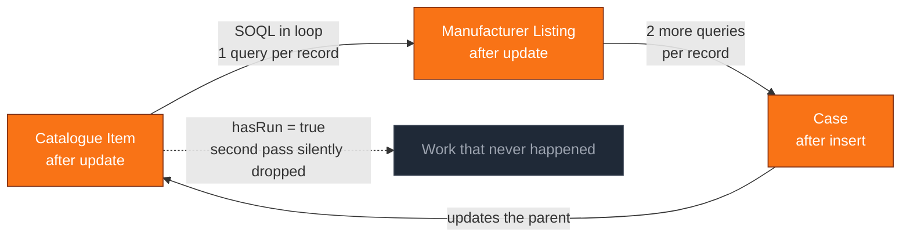
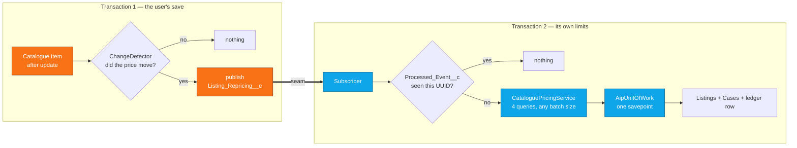
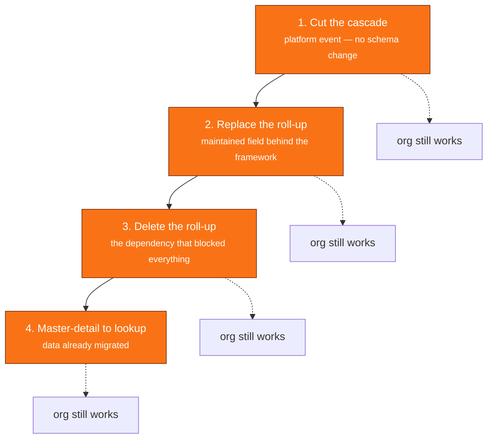

# Diagrams

Paste either block into Obsidian, or into any Mermaid renderer, and screen-record
it. Both are sized to read at 1080p.

## Before — the cycle

Three arrows on a whiteboard. Four thousand lines in a debug log.

## After — the seam

## The remediation order

Each step ships on its own. Nobody stops.
